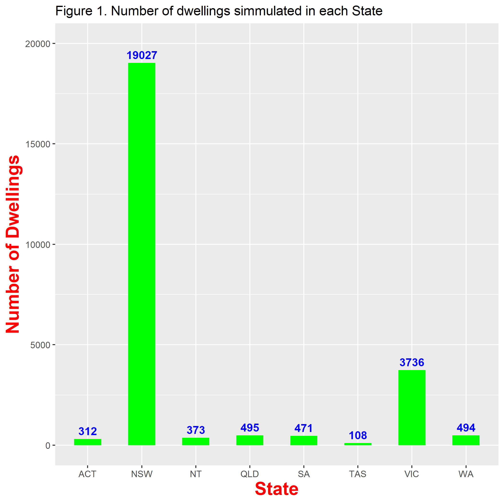

---
title: "SimpleWindow"
author: "Dong Chen"
date: "17/10/2019"
output: 
  html_document:
    toc: TRUE
    toc_float:TRUE
    code_folding:TRUE
    theme:
    highlight:zenburn
 ---

# A title

```{r do_maths, eval=FALSE, echo=FALSE,results='hide'}
3 + 4
knitr::opts_chunk$set(message = FALSE, warning = FALSE, fig.width = 3)
```

# Introduction

```{r}
library(tidyverse)
gapminder <- read.csv("res/Result2_Orig_Clean_AllState.csv") %>% group_by(State) %>%
  summarise(DwellingNo = n())
figureX <- ggplot(
  data = gapminder, 
  mapping = aes(x = State, y = DwellingNo,  label = DwellingNo,
                col.lab="red", cex.axis = 3, cex.lab = 4)
) +
  geom_col(fill = "green", width = 0.5) +
  geom_text(aes(label = DwellingNo), colour ="blue", vjust = -0.5, fontface = "bold") +
  labs(title = "Figure 1. Number of dwellings simmulated in each State",
       x = "State",
       y = "Number of Dwellings"
  ) +
  ylim(0, 20000) +
  theme(axis.title = element_text(colour = "red", face = "bold", size = 18))
figureX  
ggsave("fig/Figure_X.png", plot = figureX)
```


Make test **bold** or _italics_ or 'code'

- First thing to do
- Second thing
- Third

Some text that needs foornoting [^1]

[^1]: And here is my footnote text

1. list 1
2. second
3. last one

```{r, out.width="600px", out.height="600px",echo=FALSE}

```

# Processing data


